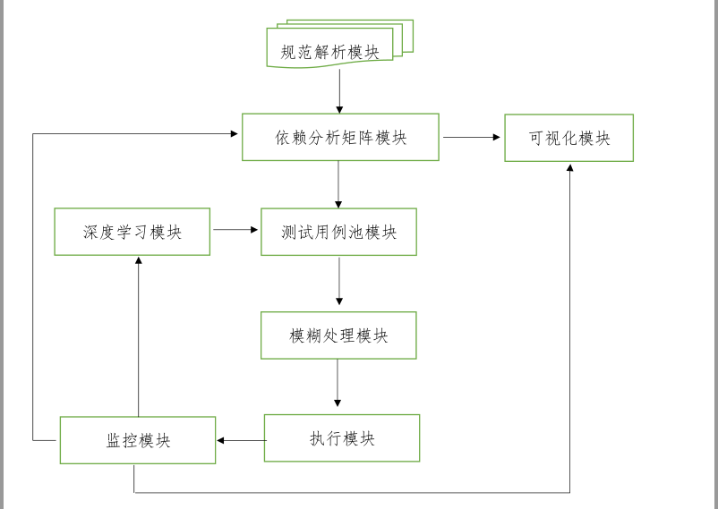

 

#  

#  

# 《面向云服务的模糊测试系统》

# 概要设计

 

# 一、   版本控制

| 版本 | 日期       | 修改人 | 说明 |
| ---- | ---------- | ------ | ---- |
| 1.1  | 2020-10-16 | 陈阳   | 初稿 |
| 1.1  |            |        |      |
| 1.1  |            |        |      |
| 1.2  |            |        |      |
| 1.2  |            |        |      |
|      |            |        |      |
|      |            |        |      |
|      |            |        |      |
|      |            |        |      |

 

 

 

# 二、   总体规划

 

 

 

 

 

 

 

 

 

 

 

 

 

 

 

 

 

# 三、   规范解析模块(parse.py)

## 1. 功能

该模块负责解析swagger文档，暴露接口供依赖矩阵模块使用

## 2. 特点

*  能够同时兼容swagger2.0和openAPI3.0

* 能够使用多种解析工具

* 未来可新增自定义规范解析，处理特殊需求

## 3. 接口

| 调用方法                                            |             |               |                |                |                             |
| --------------------------------------------------- | ----------- | ------------- | -------------- | -------------- | --------------------------- |
| **list<api_info>  get_api_info_list(path,version)** |             |               |                |                |                             |
| 入参                                                |             |               |                |                |                             |
| 序号                                                | 数据元名称  | 数据元标识    | 数据元格式     | 数据元取值示例 | 备注                        |
| 1                                                   | 解析版本    | version       | string         | 1.0            | 现在默认1.0，使用prance解析 |
| 2                                                   | 规范路径    | file_path     | string         |                |                             |
| 出参                                                |             |               |                |                |                             |
| 1                                                   | api信息列表 | api_info_list | list<api_info> |                |                             |

 

 

| 接口信息   | api_info         |             |                  |                            |                              |
| ---------- | ---------------- | ----------- | ---------------- | -------------------------- | ---------------------------- |
| 序号       | 数据元名称       | 数据元标识  | 数据元格式       | 数据元取值示例             | 备注                         |
| 1          | 接口id           | api_id      | integer          | 123                        | api的唯一标识                |
| 2          | 请求路径         | path        | string           | http://127.0.0.1/v3/person | 服务器ip+path                |
| 3          | 请求参数         | req_param   | list<field_info> |                            | 请求参数                     |
| 4          | 返回参数         | resp_param  | list<field_info> |                            | 应答参数                     |
| 5          | 请求方法         | http_method | string           | GET                        |                              |
| field_info |                  |             |                  |                            |                              |
| 序号       | 数据元名称       | 数据元标识  | 数据元格式       | 数据元取值示例             | 备注                         |
| 1          | 字段名称         | field_name  | string           | project_id                 |                              |
| 2          | 是否必填         | require     | boolean          | True                       |                              |
| 3          | 默认值           | default     | string/Integer   |                            |                              |
| 4          | 是否需要模糊处理 | fuzz        | boolean          | True                       | 从模糊字典中随机取值         |
| 5          | 位置             | location    | integer          | 1                          | 0-in 1-query 2-header 3-body |

 

 

# 四、     依赖矩阵模块(dep_analysis.py)

## 1. 功能

该模块负责分析api之间的依赖关系，生成依赖矩阵

## 2. 特点

* 判断API之间的生产者-消费者关系，使用List<api_info>的索引值作为依赖矩阵的索引，例如api_info_list[0]和api_info_list[1]具有依赖关系，填写dep_matrix\[0\]\[1\]

*  填写关联信息表weight_info\[index]

| 调用方法                              |            |                  |                |                |      |
| ------------------------------------- | ---------- | ---------------- | -------------- | -------------- | ---- |
| **dict** get_dep_info(List<api_info>) |            |                  |                |                |      |
| 入参                                  |            |                  |                |                |      |
| 序号                                  | 数据元名称 | 数据元标识       | 数据元格式     | 数据元取值示例 | 备注 |
| 1                                     | api信息表  | api_info_list    | list<api_info> |                |      |
| 出参                                  |            |                  |                |                |      |
| 1                                     | 依赖矩阵   | dep_matrix       | int[][]        |                |      |
| 2                                     | 权重信息   | weight_info_list | list<weight>   |                |      |

 

| 权重信息 | weight_info_list |                  |              |                            |                                                              |
| -------- | ---------------- | ---------------- | ------------ | -------------------------- | ------------------------------------------------------------ |
| 序号     | 数据元名称       | 数据元标识       | 数据元格式   | 数据元取值示例             | 备注                                                         |
| 1        | 字段名称         | weight_info_list | list<weight> |                            | weight是一个字典   weight_info[0]["dependency_field"] =value |
|          |                  |                  |              |                            |                                                              |
| weight   |                  |                  |              |                            |                                                              |
| 序号     | 数据元名称       | 数据元标识       | 数据元格式   | 数据元取值示例             | 备注                                                         |
| 1        | 依赖字段         | dependency_field | list<string> | [['name'],['id']]|                                                                |

 

 

# 五、     可视化模块(display.py)

## 1. 功能

* 通过依赖关系矩阵和权重表，可视化展示数据关系。

* 可视化展示代码覆盖率等测试指标（TODO）

* 可视化展示测试结果，BUG信息（TODO）

* 可视化展示测试用例池相关信息（TODO）

## 2. 特点

使用pyD3.js画出响应式依赖图。

## 3. 接口

| 调用方法                                                     |            |                  |                |                |      |
| ------------------------------------------------------------ | ---------- | ---------------- | -------------- | -------------- | ---- |
| `void dep_info_display(api_info_list,dep_matrix,weight_info_list)` |            |                  |                |                |      |
| 入参                                                         |            |                  |                |                |      |
| 序号                                                         | 数据元名称 | 数据元标识       | 数据元格式     | 数据元取值示例 | 备注 |
| 1                                                            | Api信息表  | api_info_list    | list<api_info> |                |      |
| 2                                                            | 依赖矩阵   | dep_matrix       | Int[][]        |                |      |
| 3                                                            | 权重信息   | weight_info_list | List<weight>   |                |      |

 

# 六、     模糊模块

待补充

 

# 七、     执行模块

待补充

# 八、     监控与反馈模块

待补充

# 九、     附录

 ## 9.1 字典

| 不同字段名，相同含义字典 |          |            |              |           |
 ------------------ |----------- | ------------ | ------------- | --------- 
| id            | key            |  real_key   | in           |示例       
| api_id        | id             |  group_id       | parameters or response   |{"0":{"id + group_id + parameters"}}代表api0中的parameters中的id的真实含义为group_id |